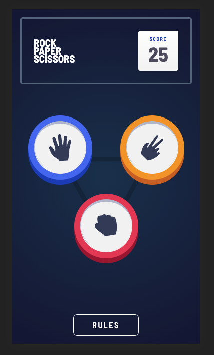

# Rock Paper Scissors

This is my solution to the [Rock, Paper, Scissors challenge on Frontend Mentor](https://www.frontendmentor.io/challenges/rock-paper-scissors-game-pTgwgvgH).

## Table of contents

- [Overview](#overview)
  - [The challenge](#the-challenge)
  - [Screenshot](#screenshot)
  - [Links](#links)
- [My process](#my-process)
  - [Built with](#built-with)
  - [What I learned](#what-i-learned)
  - [Continued development](#continued-development)

## Overview

### The challenge

Users should be able to:

- View the optimal layout for the game depending on their device's screen size
- Play Rock, Paper, Scissors against the computer
- Maintain the state of the score after refreshing the browser

### Screenshot




### Links

- Live Site URL: [Add live site URL here](https://laleonie.github.io/Rock-Paper-Scissors/)

## My process

### Built with

- Semantic HTML5 markup
- CSS custom properties
- Mobile-first workflow
- Vanilla Js

### Approach

- mobile-first design
- BEM

### What I learned

In this challenge, I very much struggled with getting the right layout down on all viewports. First, I used absolute positioning on the button elements but then I noticed that the design was running wild on all different mobile viewports. The current version uses flexboxes, which is more controllable but still leads to some unexpected. In particular, my code still doesn't ensure the correct distance between the buttons on all viewports and a uniform alignment with the background triangle.

I tried to follow the BEM approach in terms of class naming. Although this has given me more consistency with my class namings, I feel that it led a bit to a naming overload. With hindsight, I would use shorter/fewer class names for a project of this size.

I am particularly proud of the styling of the buttons, which I achieved without any reference from codepen. It feels like I'm finally getting to grips with the :before and :after pseudo class.

Overall, I found that I was a lot more confident with using CSS - although layout still remains a hurdle to be conquered. Nevertheless, I spent a lot more time on the CSS of this project, than on Js. In fact, the Js part was done surprisingly seamless.

This being said, there is still a bug in the recursion function, that I struggle to figure out. When the function enters the if-statement, it runs again but then returns undefined - although gameElement is assigned correctly.

```js
const randomSelect = () => {
  const randomNumber = Math.floor(Math.random() * 2) + 1;
  const gameElement = rules[randomNumber].selection;
  if (gameElement === storedGame.player.currentPick.selection) {
    randomSelect();
  } else {
    return gameElement;
  }
};
```

I'm particularly proud of the Promise function though, which simulates the delay for the computer's turn.

```js
delay(1000)
  .then(() => {
    updateSelectionObject("computer", randomSelectionEl);
  })
  .then(() =>
    updateButtonDOM(
      playButtons[1],
      playButtons[1].classList[1],
      storedGame.computer.currentPick.selection
    )
  )
  .then(() => {
    setTimeout(500);
  })
  .then(() => {
    updateDOM(gameSection, "StepTwo", "StepThree");
    storedGame.player.currentWin = checkPlayerWins();
    storedGame.player.currentWin
      ? (resultNode.textContent = "You Win")
      : (resultNode.textContent = "Computer Wins");
    updateScoreDOM();
    localStorage.setItem("RPS", JSON.stringify(storedGame));
  });
```

### Continued development

In future projects, I wan to avoid getting bogged down into CSS before starting the Js part.
I want to get more confident with CSS layout and how to create layouts that is consistent across devices.
I also want to make my code more robust by applying TDD.
